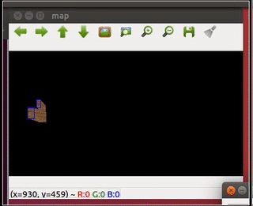

# IARC-Fuses

Fused Sensory Enhancement for IARC Mission 8.

## HUD Demo



# Guide to Running the Simulation

## Run Sim

```bash
# start firmwared in the background
sudo service firmwared restart

# sphinx simulator @ 20Hz log (= 50ms)
sphinx --datalog --datalog-rate=50 ~/sample.world /opt/parrot-sphinx/usr/share/sphinx/drones/bebop2.drone::stolen_interface=''::pose="0 0 0.2 0 0 1.679"

# ROS data logger @ 20Hz log (= 50ms)
tlm-data-logger -r 50 inet:127.0.0.1:9060 | grep omniscient_bebop2.worldTemperature -B 23 | rosrun iarc_fuses sphinx_logger 

# Bebop driver
roslaunch bebop_driver bebop_node.launch ip:=10.202.0.1 drone_Type:=bebop2 camera_info_url:="package://bebop_driver/data/bebop2_camera_calib.yaml"

# Move (teleop)
rostopic pub /bebop/takeoff std_msgs/Empty "{}" --once 
rosrun teleop_twist_keyboard teleop_twist_keyboard.py cmd_vel:=/bebop/cmd_vel
```

## Recording

```bash
rosbag record /tf /tf_static /bebop/image_raw/compressed /bebop/camera_info
```

## Playback

```bash
rosparam set /use_sim_time true
rosbag play 2019-03-09-01-54-29.bag --clock --rate 1.0 --pause -k
rosrun image_transport republish compressed in:=bebop/image_raw raw out:=bebop/image_raw
```

## Visualizing the results

```bash
LD_LIBRARY_PATH=$LD_LIBRARY_PATH:/usr/local/lib g2o_viewer -renameTypes VERTEX_SE3:EXPMAP=VERTEX_SE3:QUAT,VERTEX_XYZ=VERTEX_TRACKXYZ -typeslib /usr/local/lib/libg2o_types_sba.so -typeslib /usr/local/lib/libg2o_types_slam3d.so -typeslib /usr/local/lib/libg2o_types_data.so /tmp/ba.g2o
```
